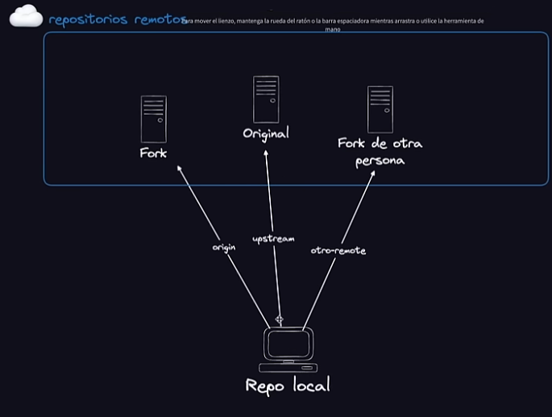
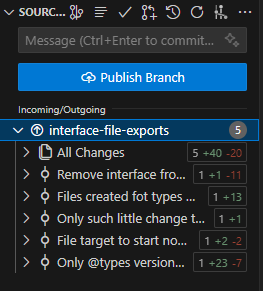
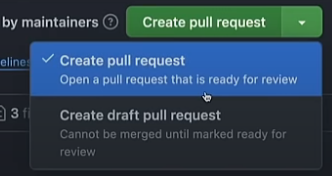
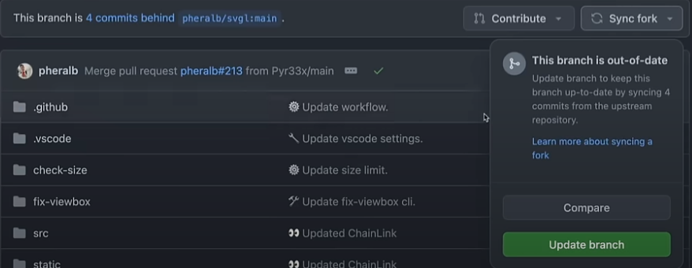
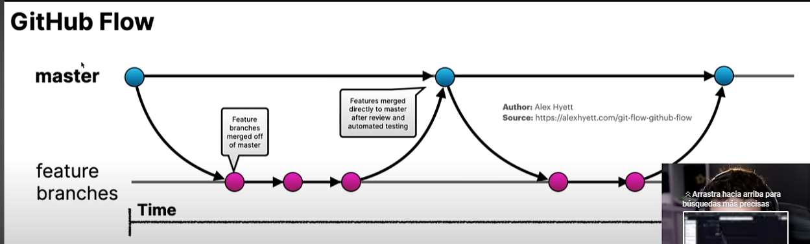

# GIT & GITHUB

La principal diferencia entre ambos es: GIT es un control de versiones, donde tenemos las ramificaciones de nuestro proyecto, y GITHUB es donde se hospeda el proyecto, es un servicio de alojamiento en la nube de nuestro codigo fuente.

**¿Donde contribuir?** 

Hay un lugar, oficial de GUTHUB, donde podemos encontrar un proyecto donde poder contribuir, son de codigo abierto en donde podemos elegir el lenguaje del proyecto al cual queremos aportar algo. https://forgoodfirstissue.github.com/

Otra alternativa puede ser: https://goodfirstissue.dev/ 


**Como clonar un proyecto**

Dentro de las posibilidades, tenemos 3 en GITHUB.


Estas son *HTTPS*, *SSH*, *GitHub CLI*. La primera no es la mas recomendada, ya que, hay que ingresar un usuario y una contraseña.

Lo ideal sería hacerlo con SSH. Aquí podemos ver una guia de como crear una clave: https://docs.github.com/es/authentication/connecting-to-github-with-ssh/generating-a-new-ssh-key-and-adding-it-to-the-ssh-agent

Al clonar un proyecto con el comando *git clone*, adicionalmente podemos utilizar una sintaxis diferente al final de la URL:

```git
git clone https://github.com/pheralb/svgl.git --depth=1
```
Con el *--depth=1* le damos profundidad, y por lo tanto, realiza la clonación mas rapido. Es porque solo hizo la descarga del *historial*, solo de la ultima rama con el ultimo *commit*.

## FORK

Para poder contribuir a un repositorio remoto, en el cual no tenemos los permisos de escritura, tenemos que hacer un *Fork* (bifurcación). Con esto logramos obtener una copia exacta del repositorio en cuestión, en el podemos hacer los cambios que queramos y, cuando estemos listos, enviar un *Pull Request* al propietario o administrador del repositorio original, y asi puede considerar incorporar los cambios que proponemos.

**No confundir CLONAR con el FORK, en el primero lo copiamos con todos los permisos de ese repositorio, y ademas obtenemos el historico. El FORK se queda en el GITHUB**

## SSH

La clonación en SSH, es muy efectiva y recomendada. Para poder hacerla, es necesario crear una KEY publica, habilitarla en GITHUB para luego tener disponible la opción de clonación con SSH.


## BRANCHES

Al *contribuir* de alguna modificación de un repositorio remoto, tenemos que crear una rama o *branch* para subir los cambios a proponer. Lo podemos hacer desde la terminal.

```bash
git switch -c "nombre-de-la-rama"
```
El *-c* es por CREAR, en sentido que estamos creando una nueva rama.

**El comando *git checkout* no esta recomendado, ya que se utiliza para otros motivos. Este comando ha sido separado en el *switch* y el *restore*. Con el primero podemos cambiar a la rama y crearla a la vez.**

Aunque, también es posible hacerlo con VSC.

## GITHUB CLI

Es una de las alternativas para clonar un repositorio.

```bash	
gh repo clone RadamantiumX/svgl
```

Una vez hecha la *clonación*, podemos ver los repositorios remotos.

```bash
git remote --verbose
```
Obtenemos esto:

```
origin  git@github.com:RadamantiumX/svgl.git (fetch)
origin  git@github.com:RadamantiumX/svgl.git (push)
upstream        git@github.com:pheralb/svgl.git (fetch)
upstream        git@github.com:pheralb/svgl.git (push)
```

## GIT REMOTE

El uso de este comando significa apuntar a un sitio en específico.

Si queremos apuntar tanto al repositorio local (*fork*), como el original (*upstream*).

```bash
git remote add "nombre" <<repositorio remoto>>
```
Haciendo esto, podemos traer los cambios de un repositorio remoto, podemos tener mas de uno. El *nombre* por lo general es *upstream*, pero podemos ponerle el que queramos.




## GIT FETCH

**git fetch** es el comando que dice a su local git que recupere la información de metadatos más reciente del original(pero no realiza ninguna transferencia de archivo. Es más como simplemente verificar si hay algún cambio disponible). ver: https://acortar.link/iGfnZq

## Commits 

Hay buenas practicas a la hora de realizar un *commit*, debe describir con mayor exactitud los cambios que se estan incorporando, no deben llevar puntos al final, ni tampoco ser tan largos. Con el **commit** estamos confirmando los cambios realizados, pero aun no los hemos enviado al repositorio.

Una vez terminado con los *commits*, veremos los cambios que van a ser incorpordos (si estamos usando VSC).



Al darle *click* a *Public Branch*, se incorporaran los cambios al repositorio, pero tambien esta el comando de GIT.

```bash
git push -u origin main
```
En el único lugar donde podemos inocorporar estos cambios es el *orgin*, en algún *upstream* no podríamos, dado que, no tenemos los permisos necesarios.

Al realizar la incorporacion, GITHUB de VSC, nos avisa que podemos hacer una **Solicitud de incorporación de cambios**, que se traduce a **Pull Request**. Es porque estamos trabajando con un repositorio *upstream* de otro propietario.


## Pull Requests (PR)

Las *PR* las podemos hacer, tanto en la RAMA PRINCIPAL, como en cualquier otra. En cuanto a las contribuciones, hay que hacer las minímas y necesarias, no modificar demasiado el codigo. 

Cuando hacemos una confirmación de un repositorio *upstream*, en GITHUB nos avisará que esta diponible una *comparación* y un **Pull Request**.


La comparación de los cambios es del *Repositorio remoto* del propietario original. Lo mas recomandado es hacer la **PR** en GITHUB.


Nos dice el repositorio base y la rama *main*, luego tenemos los cambios que hicimos con la rama que creamos, se puede hacer en el *main* de nuestro *fork*, pero siempre vamos a querer q la rama principal este actualizada con los cambios al repositorio remoto. Además, consevar el *main* como estaba, nos da la posibilidad de tener la situacion anterior disponible.

Al momento de redactar el mensaje de la **PR**, consideremos hacerlo lo mas conciso posible, pero lo mas explicita que se pueda.

Cuando terminemos, contamos con dos opciones:



Si elegimos **Create Draft Pull Request** (*Draft* = borrador), la *PR* se va a crear, pero el propietario no la va a poder *mergear*, hasta que nosotros cambiemos eso a **Pull Request** finalmente.

Cuando hagamos la **Pull Request**, no llevara al repositorio original.


Nos dice que, queremos (Repositorio *Forkeados*) *mergear* 5 *commits* dentro del repositorio original en la rama *main*, desde el repositorio remoto (nosotros), en la rama *RadamantiumX:interface-file-exports* (de este ejemplo).

Si acepta los cambios y los fusiona, tenemos la opción de eliminar la rama, pero solo en el repositorio remoto, en el local aún la tendremos.

La rama **main**, cuando se realice el *merge*, estara por debajo en *commits* que en la rama original. Es decir, nuestro **Fork** no esta **sincronizado** con el repositorio.



La forma facil de sincronizar es darle al boton en GITHUB, o mas bien podemos hacerlo con el comando de GIT.

```bash
git pull upstream main
```

Si traemos los cambios de **origin main**, vamos a tener un repositorio desactualizado, ya que nuestra rama *main*, sigue como cuando hicimos el *fork*. El **upstream** simboliza la rama superior del repositorio, es la *main del repositorio original*.

Una vez que hayamos sincronizado con la rama *main upstream*, podemos incorporar estos cambios a la rama *main* de nuestro *fork*.

```bash
git push -u origin main
```


## GITHUB FLOW

Todo esto que hicimos, es la base de GITHUB, también conocida como **GITHUB FLOW**, que es muy utilizado en el ambito empresarial.



Desde la rama *main*, creamos una nueva rama, donde metemos los *commits* y a partir de ahí, hacemos un *PR* contra la rama *main*. Lo que busca este sistema es, hacer *PR's* pequeñas, frecuentes, pero que se *mergeen* rapidamente.